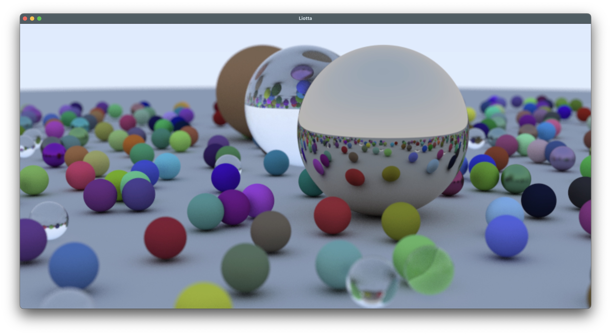

# Liotta

A simple path tracer for MacOS written in Swift, based on the book ["Ray Tracing in One Weekend"](https://github.com/RayTracing/raytracing.github.io) by Peter Shirley. 

Example scene from Chapter 12 of the book, after 25 minutes on my 2020 M1 MacBook Pro.

Notes:

Except for some small differences the code is is mostly a direct port of the C++ code in the book:

* SIMD instructions are used for some vector operations, e.g. `simd_dot`, `simd_cross`, `simd_normalize`, `simd_reflect`, `simd_refract`.
* The renderer in the book renders a single image at once. 
This renderer produces the image in multiple passes, outputting the result from each pass so that the progress can be observed.
* This renderer runs multiple raytracers concurrently in separate threads, and averages the output images  produce the final image.
Averaging two separate images with M + N samples is equivalent to averaging M + N samples from a single renderer - this property allows rendering to be parallelized relatively easily. 
Multi-threaded performance scales linearly according to the number of CPU cores.
On my 2020 M1 MacBook Pro, the renderer casts ~280k rays per second per CPU core with the sample scene from chapter 12.
Using two CPU cores is twice as fast at about 560k rays per second, and so on as more cores are used.
When three or more cores are used, the MacBook starts to heat up within a few seconds, as evidenced by the audible increase in the fan speed.
Two cores seems to be the practical sustainable limit, exhibiting only mild increases in fan whooshing.
* The book uses `drand48()` to produce random numbers.
This app only uses this random number generator for creating scenes.
Rendering noise is generated using a variant of Gold Noise, for extra raw performance and to avoid locking with multi-threading.  
  
