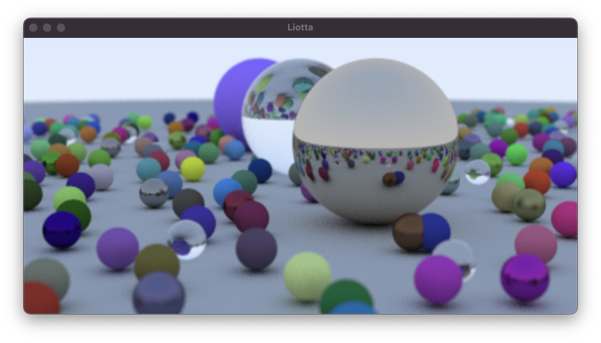

# Liotta

A simple path tracer for MacOS written in Swift, based on the book ["Ray Tracing in One Weekend"](https://github.com/RayTracing/raytracing.github.io) by Peter Shirley. 

Example scene from Chapter 12 of the book, rendered with about 240 rays per pixel.

Notes:

Except for some small differences the code is is mostly a direct port of the C++ code in the book:

* SIMD instructions are used for some vector operations, e.g. `simd_dot`, `simd_cross`, `simd_normalize`, `simd_reflect`. 
One exception is refraction which also uses the code from the book, because I could not get `simd_refract` to work.
* The example in the book casts a number of rays in randomly varying directions for each pixel, before moving on to the next pixel.
This renderer uses a different approach where only ray is cast for each pixel to produce a frame, and the average of frames is accumulated over time.
The renderer outputs an image after N frames, which is displayed in the viewport.

The performance of the ray caster is dependant on the complexity of the scene being rendered. 
On my 2020 M1 MacBook Pro, the renderer casts ~200k rays per second with simple scenes containing one or two spheres. 
The final scene from chapter 12 which contains around Z120 spheres casts ~11k rays per second. 
At this speed, the example image which used ~17 million rays took ~25 minutes to render. 
